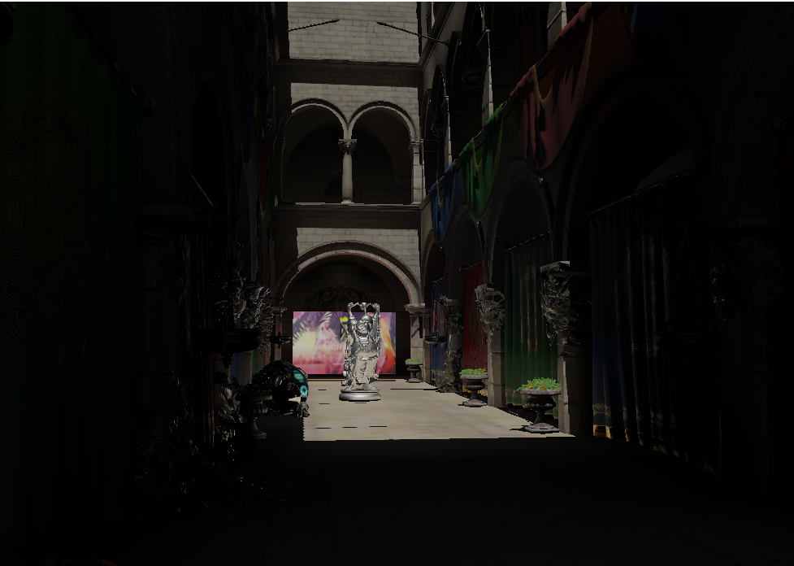
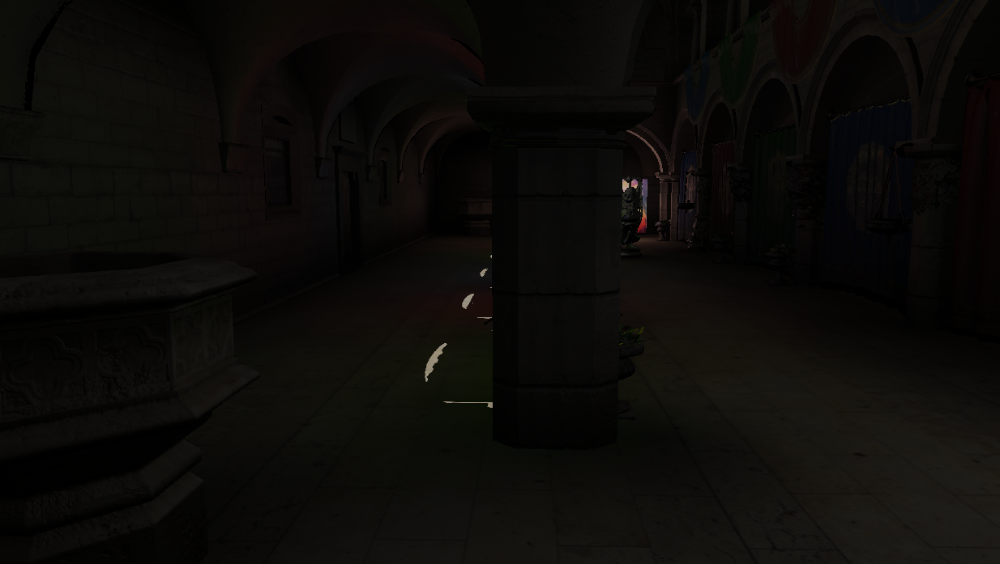
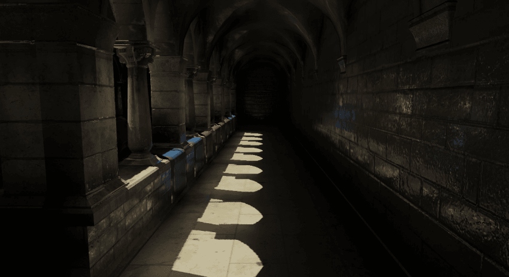
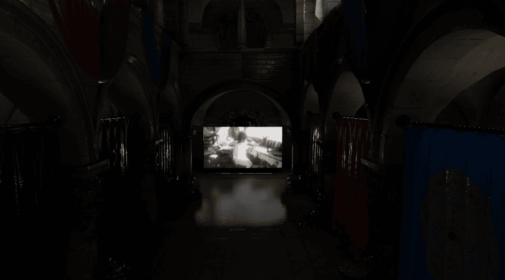
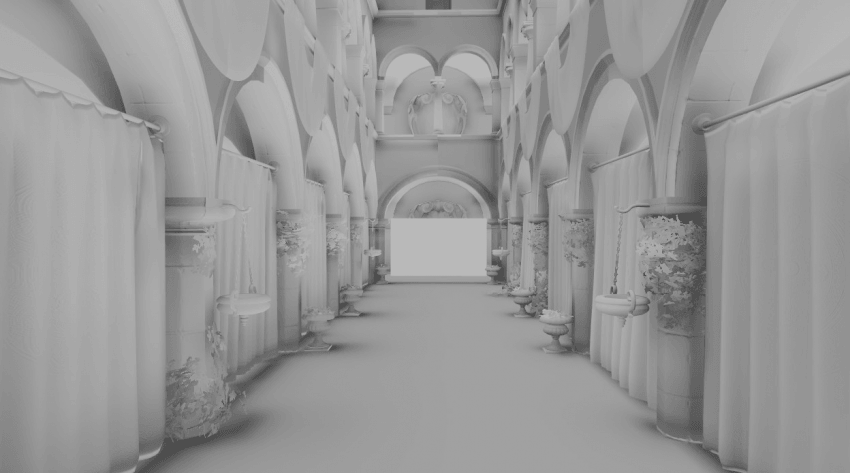
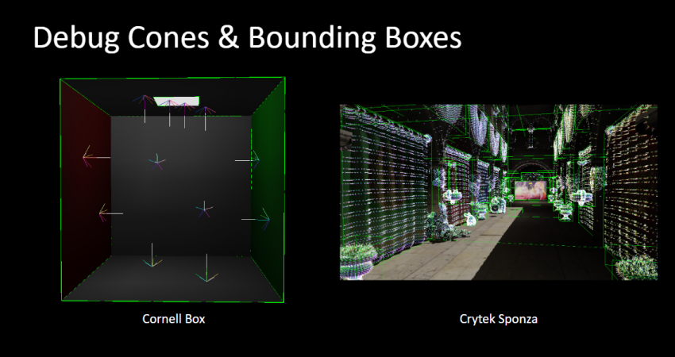
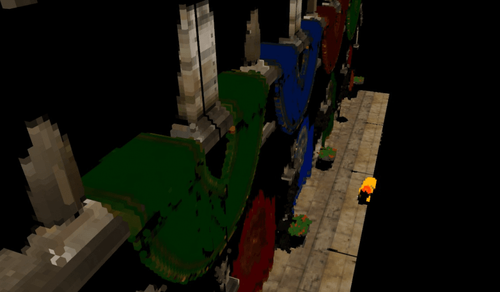

# OpenGL Model Viewer
-------------------------------------
## Descriptions
This project was study driven project for OpenGL, Voxelization, VCT, and others. So it is not well organized and optimized.
And also there are many limitation caused by lack of understand about textures format, compute shader and scene voxelization scheme.
I hope, break out these limitations in next project through this project. And also, i learned about importantness of cross validation and solid understanding through this project(also in project_mile which is previous project of this one).

As last, I would like to thanks especially to Cyril Crassin who published one of greatest piece about GI and voxelization schemes.

## Features
* Simple Scene
* Model Loader
* Build hierarchy bounding box cluster
* CPU side Frustum culling with AABB
* Scene Voxelization
* GI based on Voxel Cone Tracing (include AO)
* Physically Based Material
* Simple Compute 3D Texture Mipmap Generation
* PSM for Directional Light Source
* Camera Controller
* Camera Path(Interpolate Camera position and orientation with slerp)
* Debug AABB and Cone directions, etc

## Figures

# License
-------------------------------------
This software is provided under the **MIT License**.
